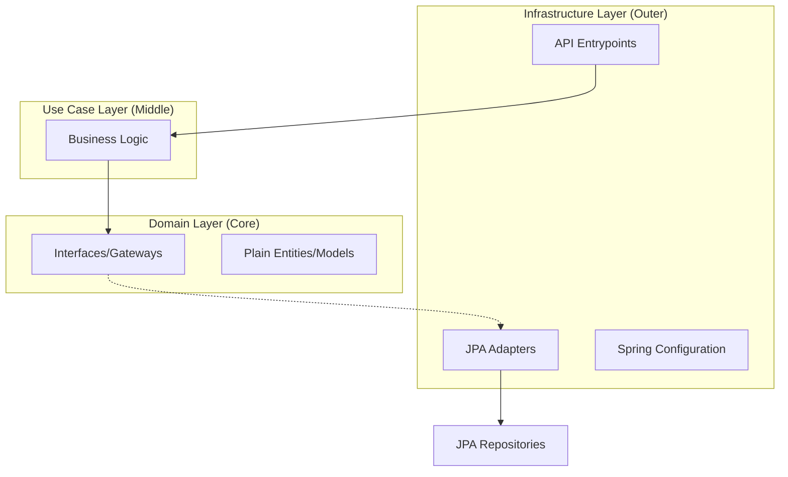

# Course Registration System

Professional Academic-like Java Backend system for course management, built with **Spring Boot 3.4** and strictly following **Clean Architecture (CA)** principles.

## Features

*   **Course Management**: Create and list courses with subject and teacher associations.
*   **Student Registration**: Seamlessly register students into existing courses.
*   **Management Panel**: Dedicated endpoints for Teacher and Subject administration.
*   **Built-in API Documentation**: Interactive Swagger/OpenAPI documentation.
*   **Clean Architecture**: High decoupling, testability, and long-term maintainability.

---

## Architecture Overview

The project is structured according to the **Hexagonal/Clean Architecture** pattern to separate business logic from technical details:



*   **`domain`**: Core business entities (POJOs) and adapter interfaces.
*   **`usecase`**: Orchestrates logic flow using domain Gateways.
*   **`infrastructure`**: Framework-specific implementation (Spring Boot, JPA, OpenAPI).
    *   **`entrypoints`**: REST controllers.
    *   **`drivenadapters`**: Persistence logic (JPA Entities, Repositories, Adapters).
    *   **`config`**: Dependency injection and Swagger setup.

---

## Getting Started

### Prerequisites

*   **JDK 25** (OpenJDK)
*   **Maven 3.9+**

### Running the application

1.  Clone the repository.
2.  In the root directory, run:
    ```bash
    mvn spring-boot:run
    ```

### Interactive API Documentation

Once the app is running, access the **Swagger UI** to test the endpoints:
[**http://localhost:8080/swagger-ui.html**](http://localhost:8080/swagger-ui.html)

---

## API Endpoints Summary

### Courses & Students
| Action | Method | URL |
| :--- | :--- | :--- |
| Create Course | `POST` | `/api/courses` |
| List Courses | `GET` | `/api/courses` |
| Register Student | `POST` | `/api/students` |
| Students in Course | `GET` | `/api/courses/{code}/students` |

### Administration (Management)
| Action | Method | URL |
| :--- | :--- | :--- |
| Create Teacher | `POST` | `/api/management/teachers` |
| List Teachers | `GET` | `/api/management/teachers` |
| Create Subject | `POST` | `/api/management/subjects` |
| List Subjects | `GET` | `/api/management/subjects` |

---

## Database

The project uses an **H2 In-Memory Database** for development. You can access the console at:
[**http://localhost:8080/h2-console**](http://localhost:8080/h2-console)

*   **JDBC URL**: `jdbc:h2:mem:testdb`
*   **User**: `sa`
*   **Password**: `password`

---
